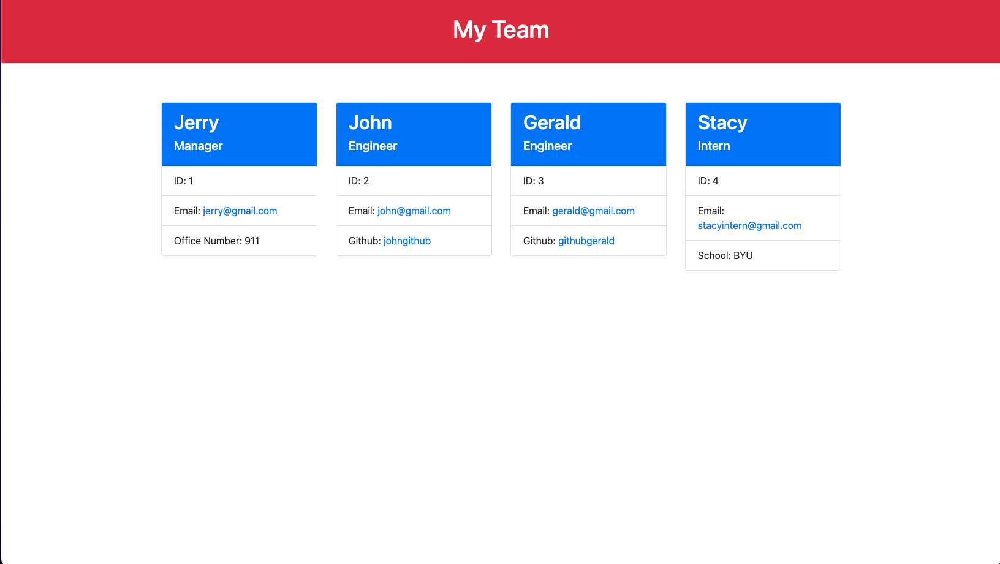

  # Jacob Canepa's Team Profile Generator
  
  ## Description
  A command-prompt application that takes user data and generates a nice looking team profile in HTML.

  ## Table of Contents
  - [Installation](#installation)
  - [Usage](#usage)
  - [Questions](#questions)

  ## Installation
  PLEASE fork repo before cloning! 
  ```
  npm install 
  ```

  ## Usage
  To get started just type the command `node index` in the root directory's terminal...

  Walkthrough: https://drive.google.com/file/d/1FpQ8CW7vBI3_rDyAMQznxEWAlfO47TBk/view?usp=sharing 

  Output: 

  ## Questions
  Github: https://github.com/jacobmcanepa
  
  Email: jacobmcanepa@gmail.com